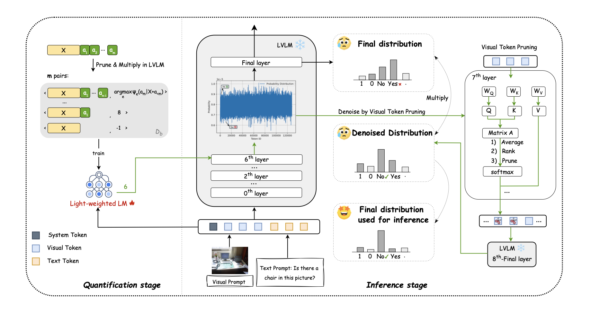

# ✂️ $ALD^{2}$: Adaptive Layer-wise Denoising Decoding in Large Vision-Language Models

> Mitigating hallucinations in Large Vision-Language Models via layer-wise denoising and multiplicative decoding

📄 **Accepted by Information Processing & Management (一区top，CCF-B)🎉**  

---

## 🚀 Overview

Large Vision-Language Models (LVLMs) suffer from **hallucinations**, often caused by **noisy representations in shallow layers**.

We propose **$ALD^{2}$**, a decoding-time framework that:

- 🔍 Identifies noisy shallow layers  
- ✂️ Applies visual token pruning  
- ✖️ Uses multiplicative decoding to enhance reliable predictions  

Unlike prior contrastive decoding methods (e.g., VCD, ICD), $ALD^{2}$:
- Works without modifying model weights  
- Models layer-wise noise explicitly  
- Improves robustness across multiple benchmarks  

---

## 🧩 Method


$ALD^{2}$ consists of three key components:

### 1. Visual Token Pruning
Set visual tokens' low-attention score to 0 to suppress noise in shallow layers.

### 2. Adaptive Layer Selection
A lightweight predictor selects the optimal denoising layer dynamically.

### 3. Multiplicative Decoding

Final decoding score:

    ψ(x) = log ( p_final(x) · p_denoised(x) )

This reinforces tokens supported by both shallow and deep layers.

---

## 📊 Results

- 📈 **+5.61%** average improvement on POPE  
- 📈 **+88.56 MME score** on LLaVA-Next-8B  
- 🧠 Significant reduction in hallucinations (CHAIR)  

---

## 🛠️ Setup

### 1. Configure Models & Shots

Edit configuration files:

```
/path/to/configs
```

You can customize:
- model paths  
- number of shots  
- decoding settings  

---

## 📦 Pipeline

### 2. Construct Training Data

```
bash /path/to/scripts/make_training_data.sh
```

---

### 3. Train Layer Predictor

```
bash /path/to/scripts/train.sh
```

- Backbone: RoBERTa-base  
- Task: layer classification  

---

### 4. Inference

```
bash /path/to/scripts/infer.sh
```

## 🧪 Supported Models

- LLaVA-1.5-7B  
- LLaVA-Next-8B  
- InstructBLIP-Vicuna-7B  
- InternVL-3.5-8B  

---

## ⚖️ Trade-offs

| Aspect        | $ALD^{2}$ |
|--------------|------|
| Accuracy      | ⭐⭐⭐⭐ |
| Hallucination | 🔻 Reduced |
| Latency       | ⬆ Higher than greedy |

---

## 📌 Key Insights

- Hallucinations originate from shallow-layer noise  
- Early layers contain useful but noisy signals  
- Denoising + multiplicative fusion improves reliability  

---

## 📖 Citation

```
@article{ZHOU2026104869,
title = {ALD2: Adaptive layer-wise denoising decoding for hallucinations mitigation in large vision-language models},
journal = {Information Processing & Management},
volume = {63},
number = {7, Part B},
pages = {104869},
year = {2026},
issn = {0306-4573},
doi = {https://doi.org/10.1016/j.ipm.2026.104869},
url = {https://www.sciencedirect.com/science/article/pii/S0306457326002608},
author = {Yuechi Zhou and Morunliu Yang and Jiaxu Zhang and Juntao Li and Siwei Feng},
}
```

---

## ⭐ Acknowledgements

Inspired by:
- Contrastive Decoding (VCD, ICD)  
- DoLa  
- Layer-wise analysis in LLMs (ALW)
